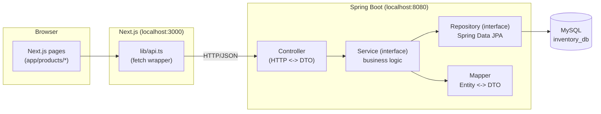
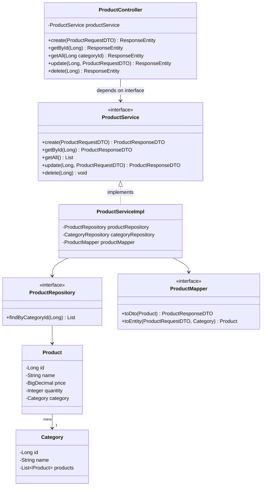
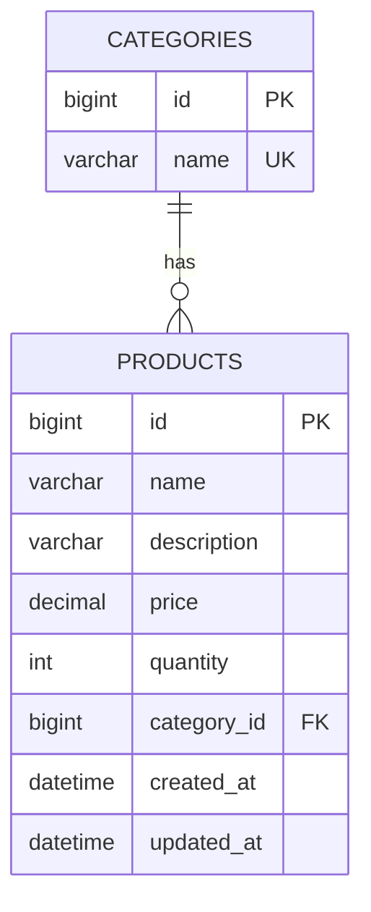

# Inventory CRUD — Fullstack Learning App

A minimal but "real-shaped" fullstack CRUD app: **Next.js 15 + TypeScript + Tailwind v4** talking to a **Spring Boot 3.5 + Spring Data JPA + MySQL** backend, built to demonstrate layered architecture and SOLID principles rather than to be a production product.

Domain: `Category` (1) → `Product` (many). Full CRUD on Products; read/create/delete on Categories.

---

## 1. Architecture



Each layer only knows about the layer directly below it, and only through an **interface**. That's what makes this "layered architecture" instead of just "files in folders."

## 2. Backend class diagram



**Where SOLID shows up in this code:**

| Principle | Where |
|---|---|
| **S**ingle Responsibility | Controller only does HTTP; Service only does business rules; Repository only does persistence; Mapper only converts Entity↔DTO. Each has one reason to change. |
| **O**pen/Closed | `ProductController` depends on the `ProductService` **interface**. You can add a new implementation (e.g. a caching decorator) without touching the controller. |
| **L**iskov Substitution | Anywhere `ProductService` is expected, `ProductServiceImpl` (or any future implementation) can be swapped in without breaking behavior. |
| **I**nterface Segregation | Separate `ProductService`/`CategoryService` and `ProductMapper`/`CategoryMapper` instead of one giant `AppService` interface — clients depend only on methods they use. |
| **D**ependency Inversion | Services depend on `ProductRepository`/`CategoryRepository` interfaces (Spring Data JPA generates the implementation); controllers depend on service interfaces. Concrete classes are injected via constructor injection (`@RequiredArgsConstructor`), never `new`'d directly. |

## 3. Database schema (ER diagram)



With `spring.jpa.hibernate.ddl-auto=update`, Hibernate generates and evolves these tables automatically from the `@Entity` classes — you never hand-write `CREATE TABLE` while learning. (In a real job, you'd switch to `validate` and manage schema changes with Flyway/Liquibase migrations instead — worth knowing that's the "next step up" once this clicks.)

---

## 4. Prerequisites (install these first)

| Tool | Version | Check with |
|---|---|---|
| Java (JDK) | 21 | `java -version` |
| Maven | 3.9+ (or use the wrapper, see below) | `mvn -version` |
| Node.js | 20+ | `node -v` |
| npm | 10+ | `npm -v` |
| MySQL Server | 8.x | `mysql --version` |
| Git | any recent | `git --version` |

If you don't have Maven installed globally, that's fine — generate a wrapper once inside `backend/`:
```bash
mvn -N wrapper:wrapper
```
Then use `./mvnw` instead of `mvn` in every command below.

---

## 5. Backend setup

1. **Start MySQL** and make sure you know your root password (or create a dedicated user).
2. Open `backend/src/main/resources/application.properties` and set your real password:
   ```properties
   spring.datasource.password=your_mysql_password
   ```
   The URL already has `createDatabaseIfNotExist=true`, so you do **not** need to manually create `inventory_db` — Spring Boot creates it on first run.
3. From the `backend/` folder:
   ```bash
   cd backend
   mvn spring-boot:run
   ```
4. On startup, Hibernate creates the `categories` and `products` tables. Confirm the API is up:
   ```bash
   curl http://localhost:8080/api/categories
   ```
   You should get `[]` (empty array) the first time.
5. Optional: browse **http://localhost:8080/swagger-ui.html** for an interactive API explorer — useful for testing endpoints before the frontend is even running.
6. Seed a category so the frontend dropdown isn't empty:
   ```bash
   curl -X POST http://localhost:8080/api/categories \
     -H "Content-Type: application/json" \
     -d '{"name":"Electronics"}'
   ```

## 6. Frontend setup

1. From the project root:
   ```bash
   cd frontend
   npm install
   cp .env.local.example .env.local
   npm run dev
   ```
2. Open **http://localhost:3000**. Click "View Products" → "+ New Product" and create one — it should hit the backend and show up in the list.

---

## 7. API reference

| Method | Endpoint | Body | Description |
|---|---|---|---|
| GET | `/api/products` | — | List all products (optional `?categoryId=`) |
| GET | `/api/products/{id}` | — | Get one product |
| POST | `/api/products` | `ProductRequestDTO` | Create |
| PUT | `/api/products/{id}` | `ProductRequestDTO` | Update |
| DELETE | `/api/products/{id}` | — | Delete |
| GET | `/api/categories` | — | List categories |
| POST | `/api/categories` | `{ "name": string }` | Create category |
| DELETE | `/api/categories/{id}` | — | Delete category |

`ProductRequestDTO` shape:
```json
{
  "name": "Wireless Mouse",
  "description": "2.4GHz USB mouse",
  "price": 19.99,
  "quantity": 100,
  "categoryId": 1
}
```

---

## 8. Push this to GitHub

From the project root (`fullstack-crud-app/`):

```bash
git init
git add .
git commit -m "Initial commit: fullstack CRUD (Next.js + Spring Boot + MySQL)"
```

Create an empty repo on GitHub (no README/license, so there's no conflict), then:

```bash
git branch -M main
git remote add origin https://github.com/<your-username>/<your-repo-name>.git
git push -u origin main
```

Double-check before pushing: `backend/src/main/resources/application.properties` currently holds your real DB password. Either:
- move it to an environment variable (`spring.datasource.password=${DB_PASSWORD}`) before committing, or
- git-ignore that file and commit an `application.properties.example` instead.

---

## 9. Suggested next steps once CRUD clicks

- Add pagination (`Pageable` in the repository/controller) instead of returning full lists.
- Add search/filter by name (the repository already has `findByNameContainingIgnoreCase`, just wire it into a controller param).
- Replace `ddl-auto=update` with Flyway migrations.
- Add unit tests: mock `ProductRepository`/`ProductMapper` and test `ProductServiceImpl` in isolation — this is exactly what the DIP setup here makes easy.
- Add JWT auth (Spring Security) and protect write endpoints.
